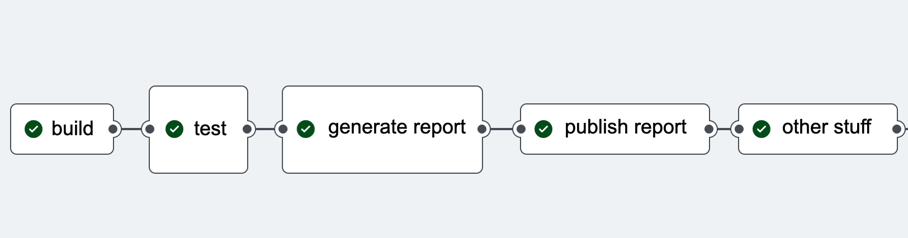
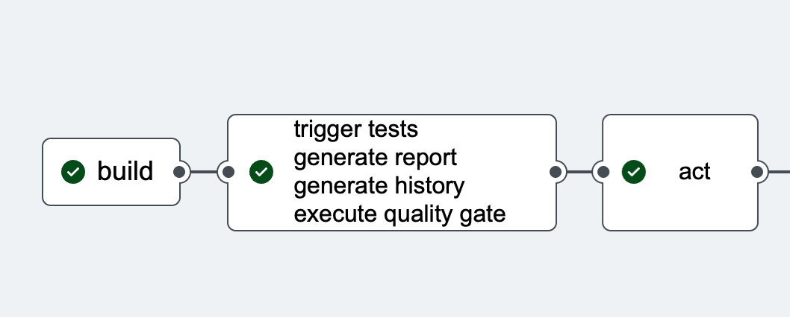

# Allure 3

## As is and To be

### As is in Allure2



```shell
pnpm test
# install java to your pipeline
allure generate
allure open
# do something with the report
```

### As is in Allure3



```shell
pnpm allure run --rerun 3 -- pnpm test
```

#### What has changed?

Report → Set of Tools

1. Modern Technology stack
   1. `npm install allure`
   1. `npx allure`
2. Generation of the report itself is optional
3. Run your favourite plug-in
   1. allure2
   2. awesome
   3. csv
   4. dashboard
   5. log
   6. jira
   7. slack
   8. testplan
   9. and others that do not exist yet
4. Act based on the previous results


## Commands

### Completely new stuff

#### run

[run - check this out](3run.md)

#### testplan

[testplan - check this out](3testplan.md)

#### log

[log - check this out](3log.md)

#### csv

[csv - check this out](3csv.md)

#### history

[history - check this out](3history.md)

#### watch

[watch - check this out](3watch.md)

### New HTML report - His Awesomeness the Awesome

#### awesome

[AWESOME - check this out](3awesome.md)

### Configuration files

[configs - check this out](3configs.md)

## What's next?

[What's next?](3whatsnext.md)

## Plugins

No stop here today. Still, here is an example of a plugin that will send a message to telegram.


[back to History](history.md)
