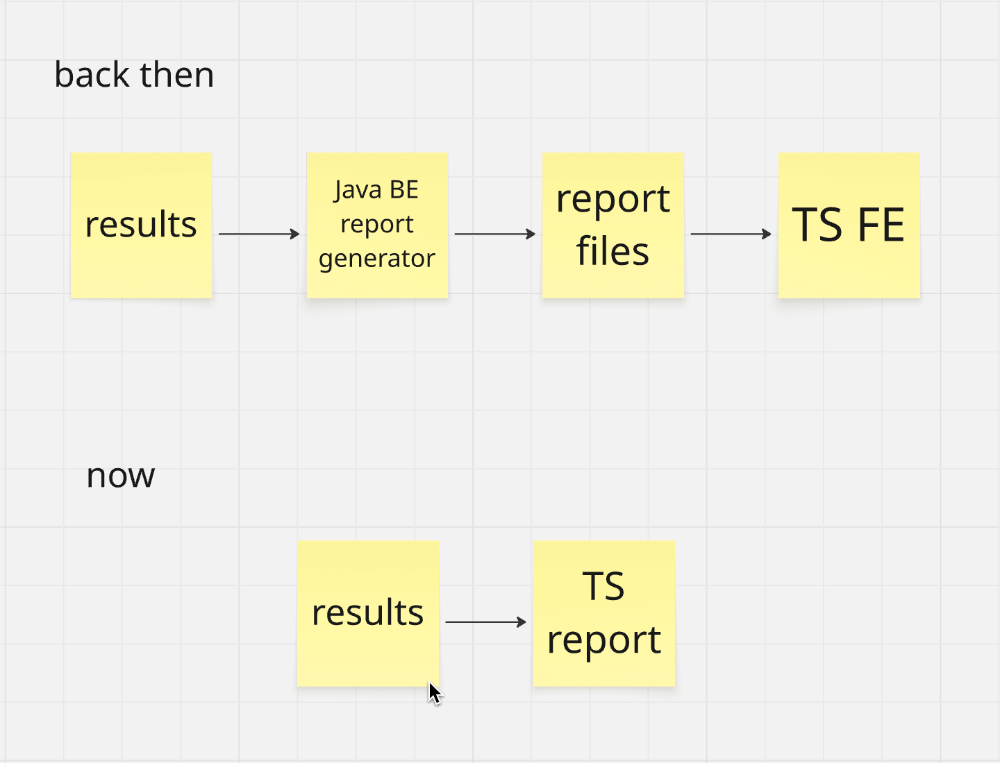

# Allure 3

## Issues to be resolved

1. You are JS/TS and suddenly you need Java to see the report.
   1. what?!
   
2. Modern Technology stack
   1. `npm install allure`
   2. `npx allure`
3. Avoid the generation of a full report each time
   1. different commands for different tasks

```shell
Commands:
  classic <resultsDir>       Generates Allure 2 report based on provided Allure Results // will be discontinued
  allure2 <resultsDir>       Generates Allure 2 report based on provided Allure Results  // will be discontinued
  awesome <resultsDir>       Generates Allure Awesome report based on provided Allure Results // this is the future
  csv <resultsDir>           Generates CSV report based on provided Allure Results
  dashboard <resultsDir>     Generates Allure Dashboard report based on provided Allure Results // WIP
  generate <resultsDir>      Generates the report to specified directory based on provided config (if any)
  history <resultsDir>       Generates the history to specified folder
  known-issue <resultsDir>   Generates a known issue list
  log <resultsDir>           Prints Allure Results to the console
  open [reportDir]           Serves specified directory
  quality-gate <resultsDir>  Returns status code 1 if there any test failure above specified success rate
  run                        Run specified command
  slack <resultsDir>         Posts test results into Slack Channel
  testplan <resultsDir>      Generates testplan.json based on provided Allure Results
  watch <resultsDir>         Watches Allure Results changes in Real-time
```

4. We need plug-ins!!!
   1. Now it's easier to build plug-ins

## Commands

### run

`run` executes the provided command e.g. `gradle clean test`

#### Cool stuff

`--rerun N`

like

```shell
allure run --rerun 2 -- ./gradlew test
```

Reruns failed tests using `testplan.json` behind the scenes if configured.

### testplan

```shell
allure run -- ./gradlew clean test
allure testplan build/allure-results
./clean.sh
export ALLURE_TESTPLAN_PATH=plugin-testplan/testplan.json
echo $ALLURE_TESTPLAN_PATH
```


### Generation of a specific HTML report by a plug-in

#### awesome <resultsDir>

All future efforts will be dedicated to this version.

Generates Allure Awesome report based on provided Allure Results

```shell
allure awesome build/allure-results
```

#### classic <resultsDir> / allure2 <resultsDir>

Will ultimately be deprecated.

Generates Allure 2 report based on provided Allure Results from <resultsDir>, has old Allure Report ver 2 look and feel.

```shell
allure allure2 build/allure-results
```

or

```shell
allure classic build/allure-results
```

### Other reporting tasks

No need to generate HTML report, then

- csv
- log

```shell
allure csv build/allure-results
```

```shell
allure log build/allure-results
```